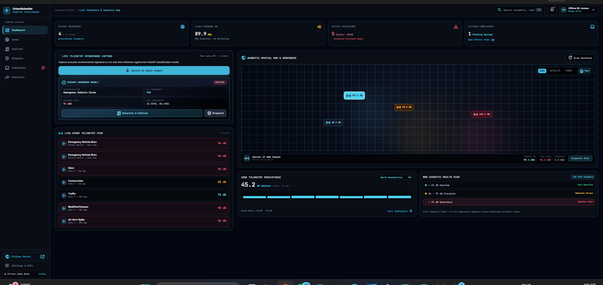
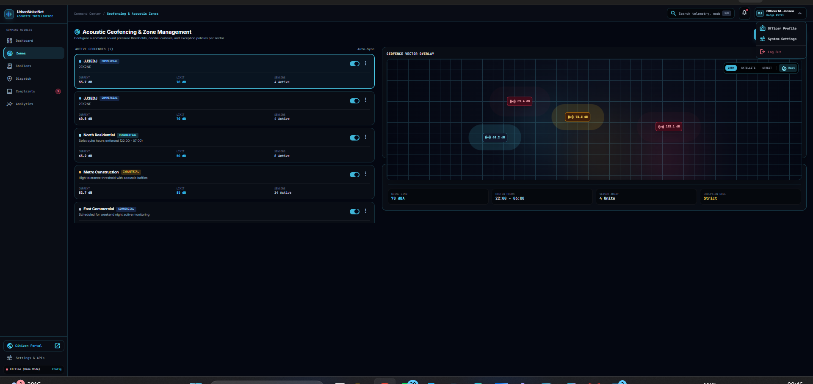
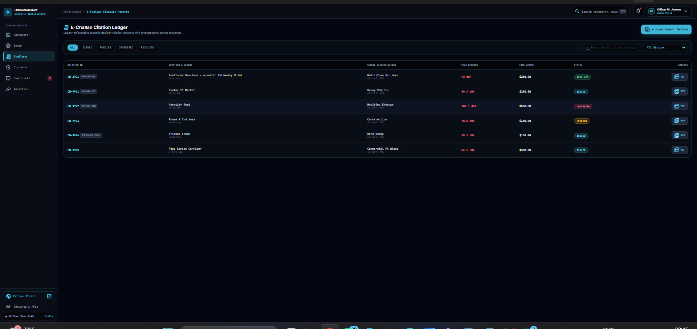
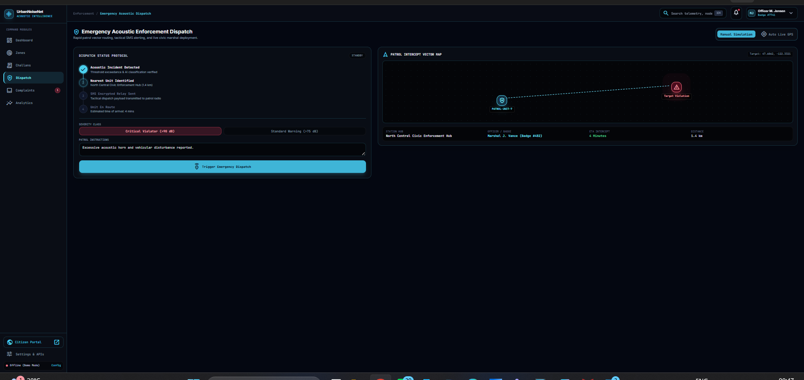
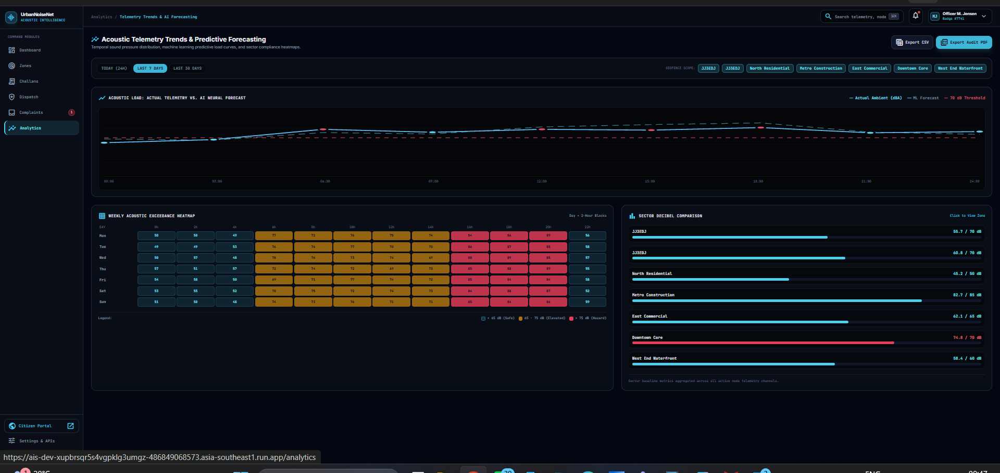

<div align="center">

# 🔊 UrbanNoiseNet

### Smart City Acoustic Intelligence & Civic Enforcement Platform

Real-time urban noise classification, geofenced monitoring, and automated enforcement — powered by machine learning.

[](https://fastapi.tiangolo.com/)
[](https://react.dev/)
[](https://scikit-learn.org/)
[](./LICENSE)

[](https://urbannoisenet-backend.onrender.com)
[](https://urban-noise-net.vercel.app)
[](#-model-performance)

[Live Demo](https://urban-noise-net.vercel.app) · [API Docs](https://urbannoisenet-backend.onrender.com/docs) · [Report Bug](../../issues) · [Request Feature](../../issues)

</div>

<br/>

<p align="center">
  
</p>

<br/>

## 📖 Overview

**UrbanNoiseNet** is an end-to-end acoustic intelligence platform built to help cities monitor, classify, and act on urban noise pollution in real time. It combines a browser-based audio capture pipeline with a trained machine learning classifier to identify noise sources — sirens, construction, traffic, horns, and more — and feeds that intelligence into a full civic enforcement workflow: geofenced zones, automated e-challans, emergency dispatch, and a public citizen complaint portal.

Built as a full-stack demonstration of applied ML in a real-world civic-tech context, with the entire pipeline — from raw audio to acoustic feature extraction to classification to enforcement action — implemented and deployed end-to-end.

<br/>

## ✨ Features

| Module | Description |
|---|---|
| 🎙️ **Live Acoustic Capture** | Real-time microphone capture via the Web Audio API, streamed for on-demand ML inference |
| 🧠 **ML Classification Engine** | MFCC feature extraction + Random Forest classifier trained on 8,700+ labeled urban audio samples (UrbanSound8K) |
| 🗺️ **Geofenced Zone Management** | Draw custom acoustic monitoring zones with per-zone decibel thresholds and curfew rules |
| 🚨 **Automated E-Challan System** | Auto-generates enforceable citations with cryptographic audit hashes and printable PDF records |
| 🚓 **Emergency Dispatch Console** | 4-step automated dispatch stepper with nearest-unit routing and live GPS tracking |
| 📣 **Citizen Grievance Portal** | Public-facing complaint submission with GPS auto-detect and live ticket tracking |
| 📊 **Predictive Analytics** | Time-series forecasting of ambient noise vs. WHO guideline thresholds, with weekly exceedance heatmaps |

<br/>

## 🖼️ Screenshots

<table>
<tr>
<td width="50%"><p align="center"><sub>Acoustic Geofencing & Zone Management</sub></p></td>
<td width="50%"><p align="center"><sub>E-Challan Citation Ledger</sub></p></td>
</tr>
<tr>
<td width="50%"><p align="center"><sub>Emergency Acoustic Dispatch</sub></p></td>
<td width="50%"><p align="center"><sub>Telemetry Trends & AI Forecasting</sub></p></td>
</tr>
</table>

<br/>

## 🏗️ Architecture

```
┌──────────────────┐         HTTPS / multipart-form         ┌──────────────────────┐
│   React + Vite    │  ─────────────────────────────────▶   │      FastAPI          │
│   (Vercel)         │       audio blob + GPS metadata        │      (Render)          │
│                     │  ◀─────────────────────────────────   │                        │
│  Web Audio API      │       classification + confidence      │  librosa (MFCC)         │
│  Dashboard / Maps   │                                          │  scikit-learn (RF model)│
└──────────────────┘                                          └──────────────────────┘
```

**Inference pipeline:** microphone → 3–4s audio clip → MFCC feature extraction (40 coefficients) → Random Forest classifier → classification label + confidence score + peak dB → returned to client → surfaced in dashboard, zone telemetry, and (if thresholds are exceeded) the e-challan / dispatch workflows.

<br/>

## 🧰 Tech Stack

<table>
<tr>
<td valign="top" width="50%">

**Backend**
- FastAPI (Python)
- scikit-learn — Random Forest classifier
- librosa — audio processing & MFCC extraction
- joblib — model serialization
- Uvicorn — ASGI server
- Deployed on **Render**

</td>
<td valign="top" width="50%">

**Frontend**
- React + Vite
- Tailwind CSS
- Web Audio API — live mic capture
- Recharts — data visualization
- Deployed on **Vercel**

</td>
</tr>
</table>

**Dataset:** [UrbanSound8K](https://urbansounddataset.weebly.com/urbansound8k.html) — 8,732 labeled urban sound excerpts across 10 classes.

<br/>

## 📊 Model Performance

Trained on 8,732 real audio samples (80/20 train-test split, stratified) using 40-coefficient MFCC feature vectors.

| Metric | Score |
|---|---|
| **Overall Accuracy** | **87.75%** |
| Test samples | 1,747 |
| Best-performing class | `air_conditioner` (F1: 0.96) |
| Safety-critical: `siren` | F1: 0.92 |
| Safety-critical: `car_horn` | F1: 0.87 |

<details>
<summary><strong>Full classification report</strong></summary>

```
                   precision   recall   f1-score   support
air_conditioner       0.97      0.95      0.96       200
car_horn              0.97      0.79      0.87        86
children_playing      0.77      0.87      0.82       200
dog_bark               0.82      0.75      0.79       200
drilling                0.90      0.86      0.88       200
engine_idling           0.95      0.96      0.95       200
gun_shot                 0.94      0.64      0.76        75
jackhammer               0.89      0.94      0.91       200
siren                     0.91      0.94      0.92       186
street_music              0.78      0.88      0.83       200

accuracy                                     0.88      1747
macro avg              0.89      0.86      0.87      1747
weighted avg            0.88      0.88      0.88      1747
```
</details>

<br/>

## 📁 Project Structure

```
UrbanNoiseNet/
├── backend/
│   ├── main.py                    # FastAPI app & /classify endpoint
│   ├── requirements.txt
│   ├── noise_classifier_model.pkl # Trained Random Forest model
│   └── label_encoder.pkl          # Class label encoder
│
├── frontend/
│   ├── src/                       # React application source
│   ├── assets/
│   ├── package.json
│   ├── vite.config.ts
│   └── vercel.json                # SPA routing config
│
├── docs/
│   └── screenshots/
│
└── README.md
```

<br/>

## 🚀 Getting Started

### Prerequisites
- Python 3.10+
- Node.js 18+
- `pip`, `npm`

### 1 — Clone the repository
```bash
git clone https://github.com/TECH-SUGATA/UrbanNoiseNet.git
cd UrbanNoiseNet
```

### 2 — Run the backend
```bash
cd backend
pip install -r requirements.txt
uvicorn main:app --reload
```
The API will be available at `http://127.0.0.1:8000` — interactive docs at `http://127.0.0.1:8000/docs`.

### 3 — Run the frontend
```bash
cd frontend
npm install
npm run dev
```
Set your backend URL in an `.env` file:
```
VITE_API_BASE_URL=http://127.0.0.1:8000
```

<br/>

## 🔌 API Reference

| Method | Endpoint | Description |
|---|---|---|
| `GET` | `/` | Health check |
| `POST` | `/classify` | Accepts an audio file (`multipart/form-data`) + optional GPS coordinates → returns classification, confidence, peak dB |

<details>
<summary><strong>Example response</strong></summary>

```json
{
  "classification": "siren",
  "confidence": 94.2,
  "peak_db": 91.6,
  "gps": { "lat": 22.5598, "lng": 88.4981 }
}
```
</details>

<br/>

## 🗺️ Roadmap

- [ ] Multi-sensor fusion for triangulated noise-source localization
- [ ] Deep learning model (CNN on spectrograms) benchmark vs. current Random Forest baseline
- [ ] Real hardware sensor node integration (Raspberry Pi + INMP441)
- [ ] Mobile app for citizen reporting
- [ ] Historical trend export & municipal reporting dashboard

<br/>

## 📄 License

Distributed under the **MIT License**. See [`LICENSE`](./LICENSE) for details.

<br/>

## 👤 Author

**Sugata Nayak**
[GitHub](https://github.com/TECH-SUGATA) · Final Year Project

<br/>

<div align="center">
<sub>Built with FastAPI, React, and scikit-learn — deployed on Render & Vercel.</sub>
</div>
